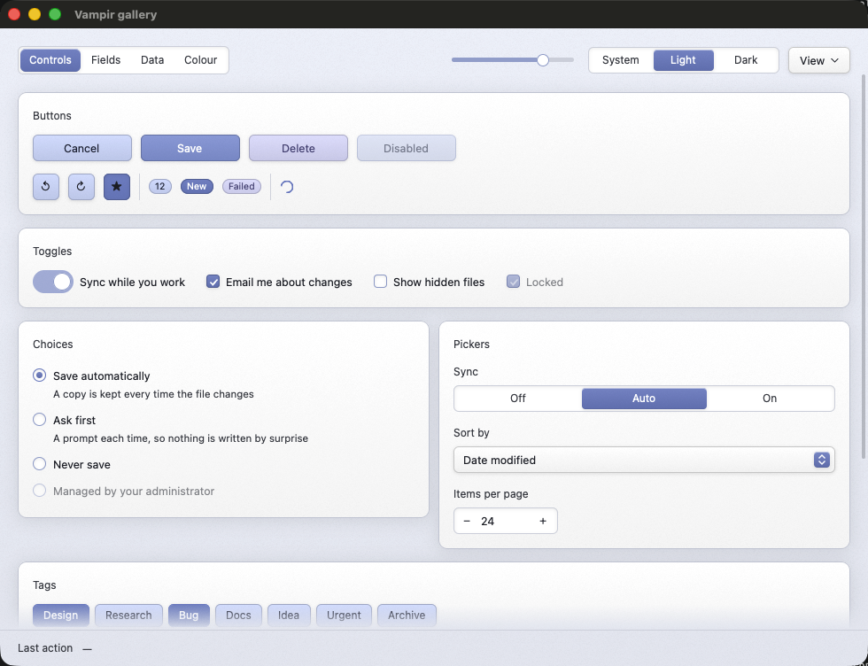

<p align="center">
  
</p>

<h1 align="center">Vampir</h1>

<p align="center">
A widget toolkit for <a href="https://www.gpui.rs">GPUI</a>.<br> Buttons, fields, pop-ups, menus, tables and text input, with a small OKLCH palette.
</p>

<p align="center">
  
  
</p>


Vampir uses a simple physical-surface visual style: panels are lit from above, interactive controls look raised, and fields and tracks look recessed. The style is shared through a small set of lighting helpers so controls remain consistent. Nothing changes in a single frame: a state that flips slides between its looks, a thing that moves slides to where it is going, and a change of scheme crosses over — whoever made the change.

Vampir is a library, not an application. It has no opinion about your app's windows, navigation or data model. The core depends only on `gpui` and `unicode-segmentation`; the default `app-icon` feature adds platform-specific icon support.

## Add Vampir to a project

Vampir builds on [gpui-ce](https://github.com/gpui-ce/gpui-ce), the community edition of GPUI that is synced from Zed and published to crates.io, so both come from the registry:

```toml
[dependencies]
vampir = "0.1"
gpui = { package = "gpui-ce", version = "0.2" }
```

Renaming the package to `gpui` lets your code, Vampir's and every GPUI example read the same way. The window and event loop live in the platform crate, which an application adds too:

```toml
gpui_ce_platform = { version = "0.1", features = ["font-kit", "runtime_shaders", "wayland", "x11"] }
```

`runtime_shaders` builds the Metal shaders when the app starts, so a Mac with only the command line tools can run it; `wayland` and `x11` are the Linux backends and are harmless elsewhere.

## How it works

Controls are functions of the data they receive. They take their value, a `Palette` and a `Context<V>`, then return an element. They do not own app state, so you can use them directly from any view that implements `ControlHost`.

Small pieces of UI state that must survive between frames, such as an open pop-up or an active drag, live in a `ControlState` on your view.

```rust
use gpui::{Context, Window, div, prelude::*};
use vampir::{ButtonVariant, ControlHost, ControlState, button};

struct Editor {
    controls: ControlState,
}

impl ControlHost for Editor {
    fn control_state(&self) -> &ControlState { &self.controls }
    fn control_state_mut(&mut self) -> &mut ControlState { &mut self.controls }
}

impl Render for Editor {
    fn render(&mut self, _window: &mut Window, cx: &mut Context<Self>) -> impl IntoElement {
        let palette = self.controls.palette();
        vampir::root(div().id("root"), self, cx).child(
            button("save", "Save", ButtonVariant::Primary, true, palette, cx,
                |editor, _window, cx| editor.save(cx)))
    }
}
```

Two calls make the keyboard and the mouse work everywhere: `vampir::bind_keys(cx)` once when the application starts binds Tab, Shift-Tab, Escape and the text-editing keys, and `vampir::root(element, self, cx)` on the view's root gives those keys somewhere to land, tracks the drags that outlive their control, and gives the keyboard somewhere to fall back to. Every control handles its own keys — Space on a button, arrows in a group — with no setup at all; see [Keyboard and focus](docs/keyboard.md).

Every `ControlState` carries a theme: hue, saturation, and a colour scheme that can follow the desktop. `self.controls.palette()` derives the palette with smooth transitions. Choose the app's hue and saturation in code to suit its purpose and visual identity; the developer or coding agent makes those design choices without requiring the end user to configure a theme. A host with a theme of its own can build a `Palette` directly:

```rust
let palette = Palette::from_hue_and_saturation(210.0, 0.55, /* dark */ true);
```

Saturation runs from zero (greyscale) through one (the original colour strength) to two (more vivid), in both light and dark schemes. `Palette::from_hue` keeps saturation one, and `Palette::neutral` is greyscale. Add theme pickers only when appearance customization is part of the product; see [Hosting › Themes](docs/hosting.md#themes) for app defaults and optional controls.

## Try the gallery

```bash
cargo run --example gallery
```

The gallery puts every widget in one window and is the smallest complete example of hosting Vampir. It opens in the desktop's light or dark scheme and follows it until you pick one. The Colour page's App theme section demonstrates hue and saturation controls that rebuild the palette live; the header's scheme control makes it easy to check both light and dark.

It also demonstrates a macOS menu bar, keyboard shortcuts and app bundling. To build and open it as a macOS application:

```bash
packaging/macos/bundle.sh --open
```

See [Shipping a macOS app](docs/macos-apps.md) for details.

| | |
|---|---|
|  |  |
| **Fields.** A full text input: selection, IME, undo, clipboard, multi-line wrapping, and rich text through a `Highlighter` closure. | **Data.** A draggable tab bar, a flattened tree, a sortable table header and a split divider. |
|  |  |
| **Overlays.** Command palette with fuzzy matching, context menus, tooltips and modal dialogs. | **Colour.** Hue and saturation sliders, an Oklch chroma-and-lightness pad, and preset swatches. |

The gallery supports both colour schemes:



## Features

**Controls** — `button`, `icon_button` (with `glyph`), `switch`, `checkbox`, `radio_group`, `segmented`, `chip` / `chip_group`, `spinbox`, `text_field`, `text_area`, `search_field`, `combo`, `slider`, `progress_bar`, `spinner`, `badge`, `separator`, `scrollbar`, `caption`, `fading_text`.

**Containers** — `tab_bar` (drag to reorder, optional close buttons) with `reorder`, `split_handle` + `split_area`, `collapsible`, `dialog`, `card`, `labelled`, `row` / `column`, `scroll_area`, `arriving`.

**Menus and overlays** — `context_menu` with nested `MenuItem::submenu` levels, `menu_button`, `menu_target`, `Tooltip`, `command_palette` and `search_list` with `fuzzy_filter` / `fuzzy_score`.

**Data** — `tree_row` with `flatten_tree`, `selectable_list` with host-owned `ListSelection`, `table_header` and `table_row` with `Column` and `SortDirection`.

**Theme** — `Theme`, `Scheme`, optional `scheme_picker`, `hue_picker` and `saturation_picker`: hue and saturation chosen by the app, a scheme that follows the desktop, and the palette derived from them.

**Colour** — `Palette`, `hue_slider`, `saturation_slider`, `color_pad`, `swatch_grid`, `hue_wheel`, and `Oklch` colour values. `DEFAULT_SATURATION` and `MAX_SATURATION` define the theme's original strength and upper limit.

**Text** — `TextInput`, `InputStyle`, `Span` and `Highlighter`.

**Lighting** — `lit`, `raised`, `recessed`, `panel`, `rim`, `glow`, `shade`, `ground`. These helpers keep gradients and shadows consistent across controls.

**The host's root** — `root`, `handle_keys`, `handle_mouse`, `bind_keys`, `edit_menu`, `ui_font`.

## The app icon

`assets/` carries a default icon for an app that has not drawn its own: `icon.png` (1024px), `icon-512.png`, `icon-256.png`, `icon.icns` for a macOS bundle and `icon.ico` for a Windows resource. Replace it the moment your app has a face of its own — it is a placeholder, not a brand.

`vampir::icon::AppIcon` is how it reaches the screen, and how you replace it — one square PNG, `AppIcon::png(include_bytes!(..))`, and the platform differences are handled for you (macOS insets it to Apple's icon grid so it matches the icons beside it in the dock). It rides on the `app-icon` feature, on by default; `default-features = false` gets back to a crate with two dependencies.

Getting it on screen takes something different on each platform: macOS hands AppKit the image at startup (and `packaging/macos/bundle.sh` puts the `.icns` in the bundle), Windows links the `.ico` in as a resource from `build.rs`, X11 passes the decoded pixels as the window icon, and Wayland reads it from a desktop entry — `packaging/linux/install.sh` installs one. [Shipping a macOS app](docs/macos-apps.md) has the details.

## Learn more

[`docs/`](docs/) is the long version, split by subject:

| | |
|---|---|
| [Hosting](docs/hosting.md) | The `ControlHost` impl, pumping drags from the root, asking for frames, ids and themes. |
| [Widgets](docs/widgets.md) | Every widget in the crate and what each is for. |
| [Keyboard and focus](docs/keyboard.md) | How every control is reached and operated from the keyboard, and where the focus ring goes. |
| [Design](docs/design.md) | Why it looks the way it does, and the rules that keep it coherent. |
| [Writing a control](docs/writing-a-control.md) | The shape a control has to keep, the traps, the checklist. |
| [Shipping a macOS app](docs/macos-apps.md) | The menu bar, the shortcuts and the bundle — what macOS does not give you for free. |

[`AGENTS.md`](AGENTS.md) is a short repository guide for automated coding tools. [`CONTRIBUTING.md`](CONTRIBUTING.md) explains how to build, test and submit changes.

## Licence

MIT. See [LICENSE](LICENSE). GPUI is Zed Industries' work under the Apache License 2.0, used here through gpui-ce; [THIRD_PARTY.md](THIRD_PARTY.md) carries the notice, and the packaged gallery ships it alongside its own licence.
