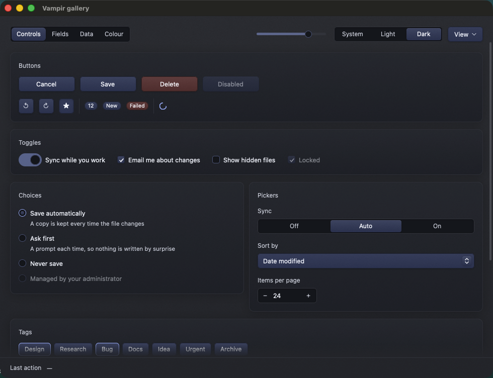
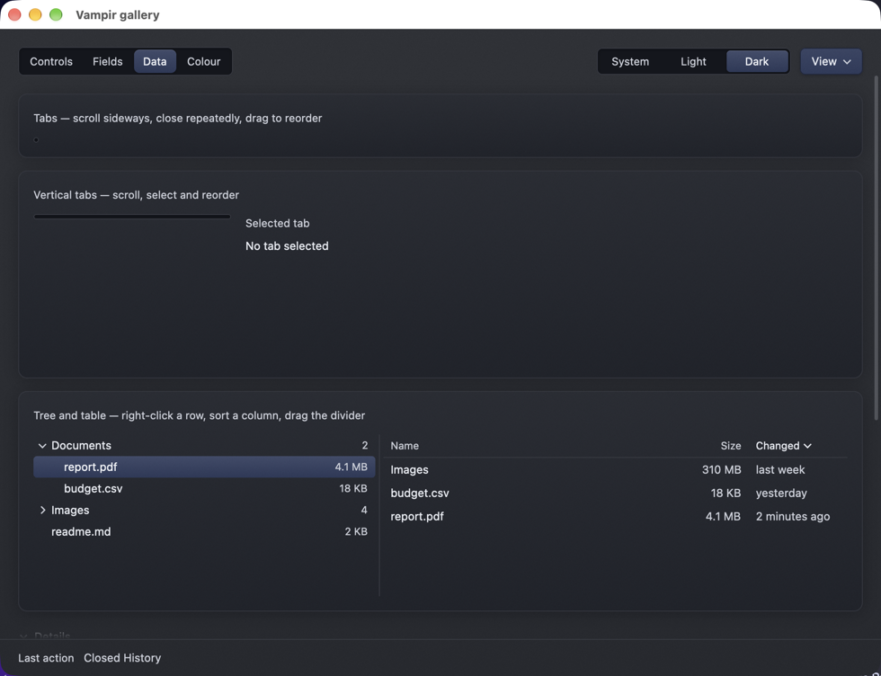
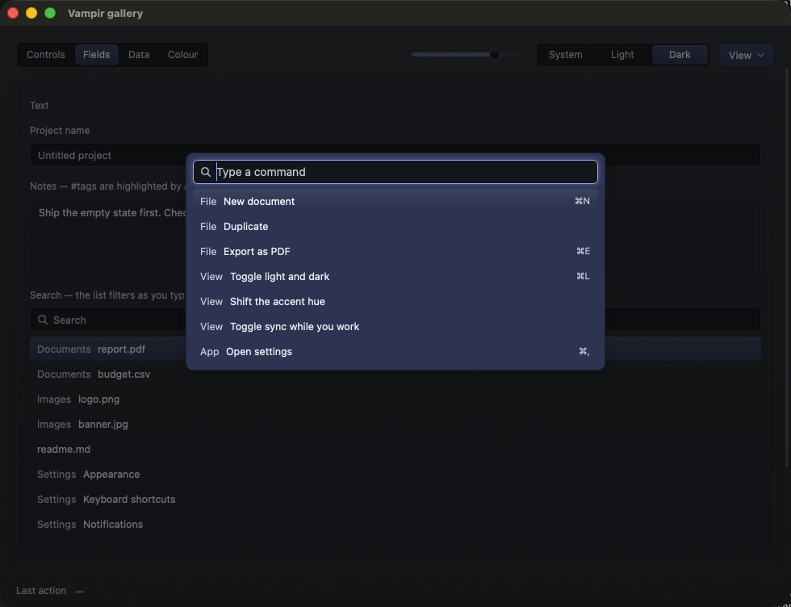
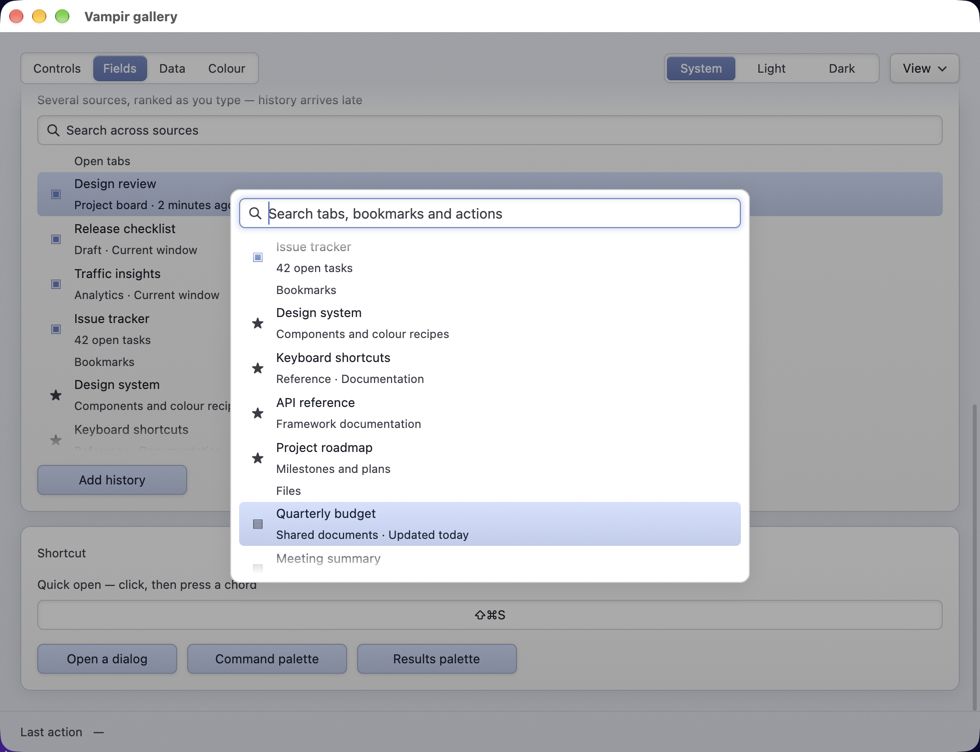
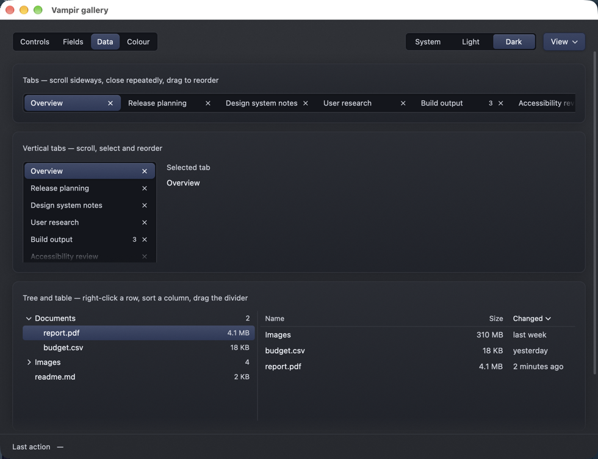
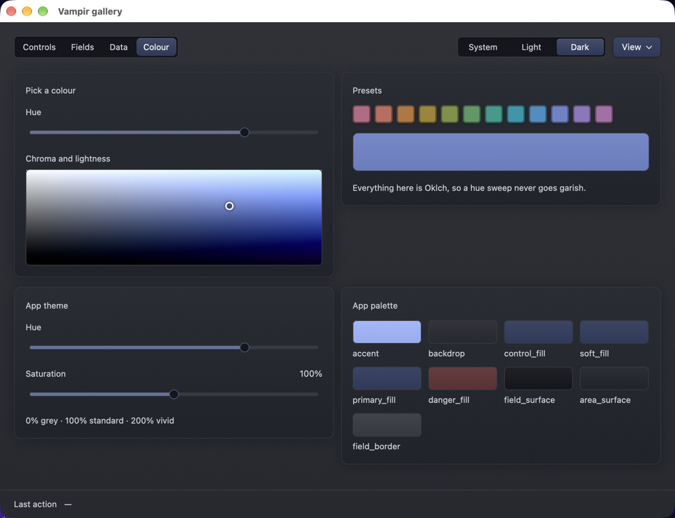
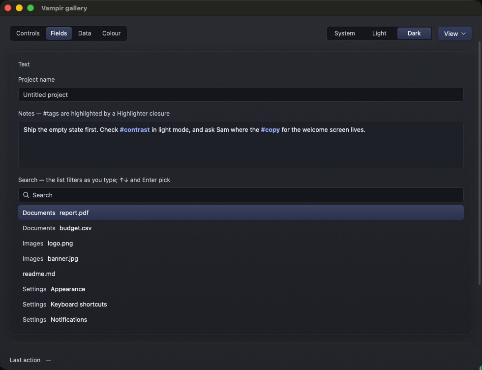

# What is in the toolkit

Most entries here are free functions generic over your view. They take a `Palette` by value and a `Context<V>` for callbacks, then return an element. `TextInput` is the main exception because it needs to retain cursor and selection state.

Every control animates its changes of state — the switch slides, the tick draws in, the selection pill moves, a re-sorted row takes its new place — whoever made the change and however. The table does not repeat it; the rules are in [Design › Motion](design.md#motion).



## Controls — `vampir::controls`

| | |
|---|---|
| `caption` | Quiet section label. |
| `fading_text` | Text that fades its new words in when it changes: a status line, a count. |
| `button` | The lit button. `ButtonVariant::{Soft, Primary, Danger}`. |
| `icon_button` | Square, takes any element as its icon — `glyph` for a text character — and a label, which it shows as its tooltip; a `Hint` carries a shortcut after the label. `active` gives it the pressed-in look of a toggle. |
| `switch` | Toggle, with an optional label that is part of the hit target. |
| `checkbox` | With an optional label; the whole row is the hit target. The well fills and the tick draws itself in. |
| `radio_group` | Vertical exclusive choices, each able to carry a `detail` line. |
| `segmented` | Recessed track, one raised pill that slides to the chosen option. Two or three short options. |
| `chip` / `chip_group` | Buttons sized to their own labels, in a wrapping row. For a choice with more options than a segmented control can carry but all worth showing: tags, a filter bar, twenty export formats. |
| `spinbox` | Steppers around an editable value field. Writes each new value into the field, and Enter commits a typed one. |
| `text_field` / `text_area` | Recessed wells around a `TextInput`. An input styled with `InputStyle::from_palette` is kept in step with the palette by the well around it. |
| `search_field` | Field with a magnifier and a clear button. |
| `combo` | Pop-up menu button and its list. The list opens over the button with the current option on it, and is shifted to stay inside the window, so one near the bottom needs nothing special. |
| `slider` | `SliderTrack::Continuous` or `Stepped { stops }`, which draws ticks and snaps. |
| `progress_bar` | Determinate. |
| `spinner` | Indeterminate. Requests frames while visible, stops when clipped out of view, and respects reduced motion — see [Hosting](hosting.md#request-frames-for-animations). |
| `badge` | `BadgeTone::{Neutral, Accent, Danger}`. |
| `separator` | Hairline rule, horizontal or vertical. |
| `scrollbar` | Overlay bar. Put it in a `.relative()` wrapper around the scroll container; it renders nothing while the content fits and fades in when it stops fitting. |

## Containers — `vampir::containers`

`tab_bar` (natural-width horizontal tabs, drag to reorder, optional close buttons, and a raised pill that slides to the active tab), `tab_bar_layout` with `TabBarLayout::{Horizontal, HorizontalUniform { width }, Vertical}`, `split_handle` + `split_area`, `collapsible` (unfolds to its measured height), `dialog` + `DialogButton`.

`HorizontalUniform` keeps each tab at the same width (clamped to 96–320), elides long labels, and scrolls sideways when the strip is full. Its close buttons stay at the same position within each tab as siblings close. `Vertical` fills the width its host gives it and scrolls down when its height is constrained. In every layout, tabs fade out into the well at an edge with more past it rather than being cut off there. Both layouts keep the same select, close and drag callbacks as `tab_bar`; arrow keys follow the layout's direction and bring the newly selected tab into view. A `Tab` is identified by its label unless `Tab::id` says otherwise, and everything the bar remembers about a tab follows that identity through a reorder. The gallery's Data page renders both dense horizontal and vertical bars over the same host-owned tabs.

Closing the final tab leaves the bar empty and returns keyboard focus to the root, so host shortcuts still work. The gallery lets you close every tab to check this state.



`split_area` is the invisible probe that turns a pointer position into a fraction. Put it inside the element the two panes share; the divider will not work without it. `reorder` is what a host does with a finished tab drag: it moves the item and keeps the selection on the item it was on.

`dialog` is opened with `ControlState::open_dialog` and renders nothing otherwise. It fades in, takes the keyboard, keeps Tab among its buttons, and closes itself — fading out, handing the keyboard back — from a button, Enter, Escape or the scrim, before the host's callback runs.

The page itself is laid out with the same vocabulary: `card` is the lit panel with a caption that everything sits on, `labelled` puts a caption over a control, `row` and `column` space controls the toolkit's way, `scroll_area` is a scrolling region on the window's ground with the edge fades and the overlay scrollbar it needs, and `arriving` fades content in and settles it into place each time what it shows changes. `card_at` is a card's colour at a given height, for anything inside one that has to blend into it, such as a scroll fade.

## Menus — `vampir::menu`

`context_menu` renders the open menu; `MenuItem::action(..).shortcut(..).checked(..).danger().disabled()` builds action rows, `MenuItem::submenu(label, items)` nests a menu to any depth, and `MenuItem::header` and `MenuItem::separator` break rows up. A submenu can also be disabled. Open the menu from wherever the press happened:

```rust
.on_mouse_down(MouseButton::Right, cx.listener(|this, event: &MouseDownEvent, _w, cx| {
    this.control_state_mut().open_menu("row", event.position, row_id.to_string());
    cx.notify();
}))
```

and render it once, near the root:

```rust
.children(vampir::context_menu("row", &self.menu_items(), self.palette, self, cx,
    |host, action, window, cx| host.run_menu_action(action, window, cx)))
```

The `target` string is yours and comes back unchanged through `ControlState::menu_target()` while the callback runs. Build the item list from it each frame so it reflects what was clicked. `menu_target` is that right-click listener as a wrapper — `menu_target("row", row.id, cx, select_on_the_way, tree_row(..))` — for a row that should open a menu about itself. `menu_button` opens the same menu beneath a button, and pressing the button again closes it.

Submenus drill into the same panel. Click a submenu row, or press Right or Enter on it, to see its children; the back row, Left and Escape return one level, while Escape at the top closes the menu. A level arriving under the pointer takes no clicks until it has arrived, so a double-click on a submenu row cannot run whatever slid under the second click. Only a leaf action calls `on_activate`, with its original id and target. The gallery's Data page has **Organize › Move to › Documents** in a row's context menu; the header's **View › Appearance › Colour scheme** is reachable from the keyboard.

These are in-window menus drawn by the toolkit. The macOS menu bar is a different thing entirely and belongs to GPUI — see [Shipping a macOS app](macos-apps.md).

## Overlays — `vampir::overlay`



`Tooltip::text` / `Tooltip::with_shortcut` plug into GPUI's own `.tooltip(..)`, which already owns the hover delay and the placement; `Hint` is what one says, for a control such as `icon_button` that carries its own.

`command_palette` is opened with `ControlState::open_palette`, or `toggle_palette` from whatever shortcut the host gives it, and renders nothing otherwise. The host owns the query `TextInput` and the `Command`s; the palette filters them with `fuzzy_filter` as the query is typed, moves the highlight with Up and Down, runs the highlighted command on Enter or a clicked one, and closes on Escape or the scrim — handing the keyboard back where it was before the command runs.

`search_list` is the same field-and-rows without the overlay: a search field with the matching rows underneath and the same keys between them, for a filter over a list in the page. The gallery's Fields page shows one filtering as you type. `command_list` is the rows on their own, for a host that filters and moves the highlight itself; `fuzzy_score` is the ranking.

`ranked_search_list` and `ranked_command_palette` are the same for results the host has already filtered and ranked: `SearchResult`s assembled from tabs, files, history, remote suggestions or any other source, drawn in the order given. A result can carry a detail line, a shortcut, a section — drawn as a heading over each run of results from it — and a leading visual drawn by the host from `SearchResult::leading`; the query is emphasised where it matches: in the label a contiguous run anywhere, or failing one an abbreviation's letters, and in the detail only a contiguous run that starts a word. The list scrolls under the query field once it is taller than a few rows and keeps the highlighted row in view; `ranked_search_list` takes the colours of the surface under its top and bottom edges, which its fades land on. The host may replace the results whenever another source finishes. A new query puts the highlight on the first result. Until the person moves it, it stays on the first row as results arrive, so a better match that lands late becomes the one Enter picks; once they have moved it, it stays on the result they moved it to, found by id, so Enter never picks something they did not choose. That is why result ids have to be unique within a list and stable across updates. `rank_results` is for a host with no ranking of its own: it scores each result's label with `fuzzy_score`, lets a match on the detail or section through after those, keeps each section's results together under one heading, and orders the sections by their best result; ties keep the order the sources were assembled in. The gallery's Ranked results card ranks its sources that way — type `design`, then add History to watch a late source arrive — and the Results palette shows the same sources in the overlay.



## Data — `vampir::data`



`tree_row` renders one row of an already flattened tree, so it drops straight into a `uniform_list`. `table_header` with `Column` and `SortDirection`; `table_row` for a row of plain text on the header's grid, which slides to its new place when the sort changes, and `table_cell` for a row that is more than text.

The tree stays the host's, and `flatten_tree` walks it into `TreeRow`s each frame, skipping the children of anything closed — the step that makes collapsing mean anything. Keeping the flattened list *as* the model is the tempting shortcut — it is what gets drawn, after all — but then closing a branch has nothing to hide, because its children were never underneath it. Sorting is the host's too: it compares keys, not the strings on screen, and only the host knows which is which.

## Selection — `vampir::selection`

| | |
|---|---|
| `selectable_list` / `ListSelection` | A scrolling list of rows the reader selects: click, Shift and Cmd/Ctrl ranges and toggles, the arrows, Select All. The host keeps the `ListSelection` and applies each `SelectionIntent`. |

`selectable_list` is a scrolling list of rows the reader can select, for any row content, with one keyboard stop for the whole list, a focus ring on the active row, and standard click, modifier-click and arrow-key selection. The host owns `ListSelection` beside its data, hands the list the rows' stable ids in order with each row's content, and applies the `SelectionIntent` it reports; the callback is given the order back, so the host keeps no copy of it for the listener. Stable ids keep a selection on the same items when the list changes order. Give the list a height and the colours of the surface behind its top and bottom edges, for the edge fades; inside a `card`, the card's two ends, `lit_stops(palette.area_surface, CARD_LIFT)`, are near enough. Filtered to nothing while it has the keyboard, it hands the keyboard to the root. Up, Down, Home and End scroll the active row into view; Shift extends from the anchor, or from the active row when there is none. The gallery's Data page demonstrates range selection, toggling, Select All and moving the keyboard past the visible rows.

## Colour — `vampir::swatch`



`hue_slider`, `saturation_slider`, `color_pad` (chroma across, lightness up), `swatch_grid`, `hue_wheel`. The hue, pad, swatches and wheel use `Oklch`; the saturation slider uses the palette's `0.0..=2.0` chroma multiplier. Zero is grey, one is the original colour strength, and two is more vivid. Its drag reports a normalized track position; convert with `Theme::saturation_from_track` when storing the value.

## Shortcuts — `vampir::shortcut`

`shortcut_recorder` captures the next chord and hands back a `Chord` with both a `keystroke` for `KeyBinding` and a `display` for a person. Binding it is the host's business. `display("secondary-k")` renders a binding the way the platform writes it.

## Theme — `vampir::theme`

Every `ControlState` carries a `Theme` — hue, saturation, and a `Scheme` of `System`, `Light` or `Dark` — and `ControlState::palette()` derives the palette with smooth transitions. `ControlState::observe_appearance` keeps `System` following the desktop. The developer or coding agent chooses the app's hue and saturation in code to suit its purpose; user-facing theme controls are optional. `scheme_picker`, `hue_picker` and `saturation_picker` bind directly to the theme when the product calls for customization; `system_dark` reads the desktop. The gallery demonstrates hue and saturation under App theme on the Colour page. See [Hosting › Themes](hosting.md#themes).

## Text — `vampir::text_input`



`TextInput` is a full input: selection, IME composition, undo, clipboard, multi-line wrapping. It is the one thing in the crate that is an entity rather than a function, because a text cursor genuinely is state.

`InputStyle::from_palette(palette, size)` is the style to start from; an input styled that way is kept in step with the palette by whichever field holds it, so a host never re-styles its inputs by hand.

Rich text is a `Highlighter`, a closure from content to `Span`s, re-run on every layout:

```rust
input.update(cx, |input, cx| {
    input.set_highlighter(|text| {
        find_mentions(text).map(|range| Span::new(range).accent().bold()).collect()
    }, cx);
});
```

`Span::accent()` reads the accent when the text paints, so a highlighter set once follows the theme; `Span::color` is a fixed colour. Stale ranges are dropped rather than panicked on, because a highlighter usually runs against text that has since been edited.

## Colour and lighting — `vampir::color`, `vampir::lighting`

`Palette::from_hue_and_saturation(hue, saturation, dark)` derives the whole set from an app's chosen hue and saturation. `Palette::from_hue(hue, dark)` keeps the original saturation of one, and `Palette::neutral(dark)` is greyscale. A host with a richer theme of its own writes the twenty-odd fields directly, which is the point of the struct being plain and public. `Palette::backdrop` is the window's own ground, and `ground(palette.backdrop)` lights it for the root.

`lighting` is the vocabulary every control draws itself with — `lit`, `raised`, `recessed`, `panel`, `rim`, `glow`, `shade`, `ground`. [Design](design.md) explains what each means and when to reach for it.

## Type — `vampir::typography`

`ui_font()` is the system's interface face under the name each platform knows it by, for `.font_family` on the root. `TEXT_SIZE`, `SMALL_TEXT_SIZE` and `TITLE_TEXT_SIZE` are the three sizes the toolkit sets text in.
